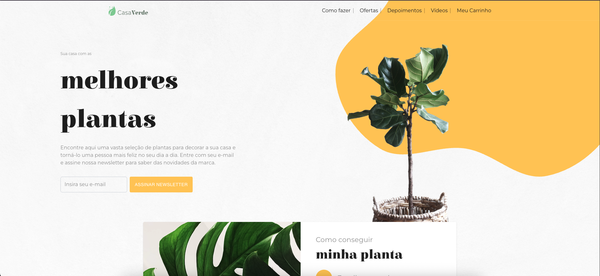

# Casa Verde
Casa Verde é o projeto de desafio proposto no `7 Days of Code` da `Alura`.
 
## Dependências
- React
- Vite
- Tailwind
- TypeScript
- Mui Material


## Screenshots



## Para rodar em localhost

Clone o projeto

```bash
git clone https://github.com/HelenCrisM/Casa-Verde.git
```

Vá para o diretório

```bash
cd Casa-Verde
```

Instalar as dependências

```bash
npm install
```

Iniciar o servidor

```bash
npm run dev
```

Acesse no navegador

```bash
http://localhost:5174/
```